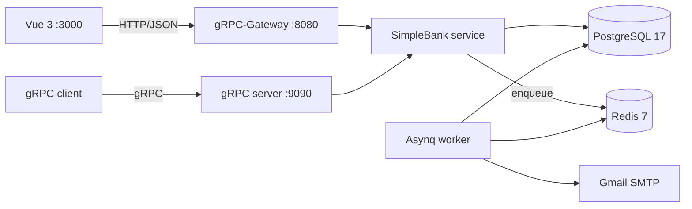

# Simple Bank

[](https://go.dev/)
[](https://www.postgresql.org/)
[](https://redis.io/)
[](https://grpc.io/)

Simple Bank là project full-stack mô phỏng một hệ thống ngân hàng nhỏ, được xây dựng bằng Go, PostgreSQL, Redis và Vue 3. Backend hiện phục vụ đồng thời gRPC và HTTP/JSON qua gRPC-Gateway, tự động chạy migration khi khởi động, xử lý email xác thực bất đồng bộ và cung cấp Swagger UI.

Project gồm backend Go (gRPC + HTTP Gateway), worker gửi email bất đồng bộ, Docker Compose cho local, CI với GitHub Actions và manifest triển khai AWS EKS, kèm frontend Vue 3.

## 📖 Tài liệu

- **[AI Documentation](/.ai-docs/)** - Tài liệu chi tiết về kiến trúc, API, business rules và hướng dẫn phát triển
- **[Swagger UI](http://localhost:8080/swagger/index.html)** - API documentation (khi chạy local)
- **[Database Schema](doc/db.dbml)** - DBML schema definition

## ✨ Tính năng

### Core Features
- 🔐 **Xác thực & Phân quyền**: PASETO tokens với access/refresh token flow, role-based authorization (depositor, banker)
- 📧 **Email Verification**: Background task processing với Asynq và Gmail SMTP
- 💸 **Money Transfers**: ACID transaction với deadlock prevention và audit trail
- 👤 **User Management**: Registration, login, profile updates với validation
- 🏦 **Multi-currency Accounts**: USD, EUR, CAD support với unique constraint per user

### Technical Highlights
- ⚡ **Dual Protocol**: gRPC + HTTP/JSON Gateway phục vụ đồng thời
- 🔄 **Auto Migration**: Database schema tự động cập nhật khi khởi động
- 📊 **Structured Logging**: Zerolog với development-friendly console output
- 🔒 **Session Management**: PostgreSQL-backed sessions với revocation support
- 📖 **Embedded Swagger UI**: API documentation được bundle vào binary
- 🐳 **Docker Ready**: Docker Compose cho local, Kubernetes manifests cho production
- 🚀 **CI/CD**: GitHub Actions với automated testing và AWS EKS deployment

## Kiến trúc



`main.go` khởi động HTTP gateway, gRPC server và worker trong cùng một process. Migration trong `db/migration` được áp dụng tự động trước khi các server bắt đầu nhận request.

## Công nghệ chính

| Thành phần | Công nghệ |
| --- | --- |
| Backend | Go 1.26, gRPC, gRPC-Gateway, Gin |
| Database | PostgreSQL 17, pgx/v5, sqlc, golang-migrate |
| Xác thực | PASETO, JWT implementation dùng cho test/tham khảo, bcrypt |
| Tác vụ nền | Redis 7, Asynq |
| API docs | Protocol Buffers, OpenAPI v2, Swagger UI, statik |
| Frontend | Vue 3, TypeScript, Vite, PrimeVue, Axios |
| Hạ tầng | Docker, Docker Compose, Kubernetes, AWS EKS/ECR |
| Kiểm thử | Go testing, Testify, GoMock, Vitest |

## Khởi chạy nhanh bằng Docker Compose

### Yêu cầu

- Docker Engine hoặc Docker Desktop có Docker Compose.
- Các cổng `5432`, `6379`, `8080` và `9090` chưa bị ứng dụng khác sử dụng.

### 1. Kiểm tra cấu hình

Sao chép file cấu hình mẫu rồi chỉnh nếu cần:

```bash
cp app.env.example app.env
```

`TOKEN_SYMMETRIC_KEY` phải có đúng 32 ký tự. Nếu chưa cần gửi email thật, giữ nguyên thông tin Gmail placeholder; worker sẽ retry các tác vụ gửi email thất bại.

### 2. Khởi động stack

```bash
docker compose up --build -d
```

Nếu máy chỉ cung cấp binary Compose độc lập, dùng `docker-compose` thay cho `docker compose`.

Compose sẽ khởi động:

- PostgreSQL tại `localhost:5432` (user `root` / password `secret`);
- Redis tại `localhost:6379`;
- HTTP gateway tại `http://localhost:8080`;
- gRPC server tại `localhost:9090`.

Xem log và dừng stack:

```bash
docker compose logs -f api
docker compose down
```

Thêm `-v` vào lệnh `down` nếu muốn xóa cả PostgreSQL volume:

```bash
docker compose down -v
```

### 3. Kiểm tra dịch vụ

- Swagger UI: <http://localhost:8080/swagger/index.html>
- HTTP API: <http://localhost:8080/v1/>
- gRPC reflection: `localhost:9090`

Tạo một người dùng mẫu:

```bash
curl -X POST http://localhost:8080/v1/create_user \
  -H "Content-Type: application/json" \
  -d '{
    "username": "alice_01",
    "full_name": "Alice Nguyen",
    "email": "alice@example.com",
    "password": "secret123"
  }'
```

Đăng nhập:

```bash
curl -X POST http://localhost:8080/v1/login_user \
  -H "Content-Type: application/json" \
  -d '{"username":"alice_01","password":"secret123"}'
```

## API đang được phục vụ

Các RPC trong `proto/service_simple_bank.proto` được mở đồng thời qua gRPC và HTTP gateway:

| RPC | HTTP | Xác thực | Mô tả |
| --- | --- | --- | --- |
| `CreateUser` | `POST /v1/create_user` | Không | Tạo user và enqueue email xác thực |
| `LoginUser` | `POST /v1/login_user` | Không | Tạo session, access token và refresh token |
| `UpdateUser` | `PATCH /v1/update_user` | Bearer access token | Cập nhật từng phần thông tin user |
| `VerifyEmail` | `GET /v1/verify_email` | Không | Xác thực bằng `email_id` và `secret_code` |

Ví dụ gọi endpoint được bảo vệ:

```bash
curl -X PATCH http://localhost:8080/v1/update_user \
  -H "Content-Type: application/json" \
  -H "Authorization: Bearer <access_token>" \
  -d '{"username":"alice_01","full_name":"Alice Tran"}'
```

> **REST (Gin):** cùng cổng HTTP `8080` còn phục vụ các route `/users`, `/accounts`, `/transfers`, `/tokens/renew_access` bên cạnh gateway `/v1/*` và Swagger `/swagger/`.

## Chạy local cho development

### Yêu cầu

- Go `1.26.x`;
- PostgreSQL `17` và Redis `7` (có thể chạy qua Compose);
- Node.js `20+` và npm cho frontend;
- GNU Make nếu muốn dùng các shortcut trong `Makefile`.

### Backend

Khởi động PostgreSQL + Redis (publish cổng ra host):

```bash
make infra-up
# hoặc: docker compose up -d postgres17 redis
```

Sao chép cấu hình rồi chạy backend trên host:

```bash
cp app.env.example app.env
go mod download
go run main.go
```

Ứng dụng tự chạy migration. Nếu chỉ muốn chuẩn bị database để chạy test:

```bash
make migrateup
```

### Frontend

Frontend gọi API qua `VITE_API_BASE_URL` (mặc định `http://localhost:8080`). Chạy backend trước, rồi:

```bash
cd frontend
cp .env.example .env
npm ci
npm run dev
```

Mở <http://localhost:3000>. Origin này đã có trong `ALLOWED_ORIGINS` của cấu hình development.

Các lệnh frontend khác:

```bash
npm run build
npm run test:unit
npm run lint
```

## Cấu hình môi trường

| Biến | Ý nghĩa |
| --- | --- |
| `ENVIRONMENT` | `development` bật console log dễ đọc; giá trị khác dùng JSON log |
| `ALLOWED_ORIGINS` | Danh sách origin được CORS cho phép |
| `DB_SOURCE` | PostgreSQL connection string |
| `MIGRATION_URL` | Nguồn migration, mặc định `file://db/migration` |
| `REDIS_ADDRESS` | Địa chỉ Redis dùng bởi Asynq |
| `HTTP_SERVER_ADDRESS` | Địa chỉ lắng nghe của HTTP gateway |
| `GRPC_SERVER_ADDRESS` | Địa chỉ lắng nghe của gRPC server |
| `TOKEN_SYMMETRIC_KEY` | Khóa 32 ký tự dùng để mã hóa PASETO |
| `ACCESS_TOKEN_DURATION` | Thời hạn access token, ví dụ `15m` |
| `REFRESH_TOKEN_DURATION` | Thời hạn refresh token, ví dụ `24h` |
| `EMAIL_SENDER_NAME` | Tên người gửi email |
| `EMAIL_SENDER_ADDRESS` | Tài khoản Gmail SMTP |
| `EMAIL_SENDER_PASSWORD` | Gmail App Password |

Không dùng các credential development trong production. Workflow deploy hiện tải cấu hình production từ AWS Secrets Manager trước khi build image.

## Kiểm thử

Phần lớn API test dùng mock store; các test trong `db/sqlc` là integration test và cần PostgreSQL đã chạy, database `simple_bank` đã được tạo và migration đã được áp dụng.

```bash
docker compose up -d postgres17
make migrateup
make test
```

Hoặc chạy trực tiếp:

```bash
go test -v -cover -short ./...
```

Test gửi email thật được bỏ qua ở chế độ `-short`.

## Code generation và công cụ phát triển

| Lệnh | Tác dụng |
| --- | --- |
| `make sqlc` | Sinh code Go từ query SQL bằng sqlc |
| `make proto` | Sinh protobuf, gRPC, gateway, OpenAPI và bundle Swagger |
| `make mock` | Sinh mock cho database store và task distributor |
| `make new_migration name=<ten>` | Tạo cặp migration mới |
| `make migrateup` / `make migratedown1` | Áp dụng hoặc rollback migration |
| `make db_docs` | Publish database docs từ DBML |
| `make db_schema` | Sinh `doc/schema.sql` từ DBML |
| `make evans` | Mở Evans REPL qua gRPC reflection |

Các lệnh này lần lượt cần cài thêm `sqlc`, `protoc` cùng các Go plugin, `statik`, `mockgen`, `golang-migrate`, `dbdocs`, `dbml2sql` hoặc `evans` tùy tác vụ.

Sau khi thay đổi schema/query, hãy cập nhật đồng bộ migration, `doc/db.dbml`, code sqlc và test. Sau khi thay đổi proto, chạy lại `make proto` để cập nhật cả `pb`, OpenAPI và Swagger bundle.

## 📁 Cấu trúc thư mục

```text
.
├── .ai-docs/            # 🤖 AI-optimized documentation (architecture, APIs, business rules)
├── .github/workflows/   # CI/CD workflows (test, deploy)
├── api/                 # REST API dùng Gin (accounts/transfers trên cùng cổng HTTP)
├── db/
│   ├── migration/       # PostgreSQL migrations
│   ├── query/           # SQL source cho sqlc
│   ├── sqlc/            # Code sinh + transaction/store tùy chỉnh
│   └── mock/            # Mock database store
├── doc/                 # DBML, schema, OpenAPI và Swagger bundle
├── eks/                 # Manifest triển khai AWS EKS
├── frontend/            # Vue 3 + TypeScript + Vite
├── gapi/                # Implementation gRPC/HTTP gateway đang chạy
├── mail/                # Gmail sender
├── pb/                  # Code sinh từ Protocol Buffers
├── proto/               # Định nghĩa service và message
├── token/               # PASETO/JWT token makers
├── util/                # Config, password, role, currency, random data
├── val/                 # Validation cho gRPC request
├── worker/              # Asynq distributor/processor và email task
├── main.go              # Composition root, migration và graceful shutdown
├── docker-compose.yaml  # Local stack: API, PostgreSQL, Redis
└── Makefile             # Shortcut cho development workflow
```

## CI/CD và triển khai

- `.github/workflows/test.yml` chạy migration và Go test khi push/pull request vào `master`.
- `.github/workflows/deploy.yml` build image, push lên ECR và apply manifest EKS khi push vào `release`.
- `eks/` định nghĩa Deployment 2 replica, HTTP/gRPC Service, NGINX Ingress và Let's Encrypt ClusterIssuer.

Các manifest hiện chứa AWS account, region, domain và tên cluster cụ thể của môi trường mẫu. Hãy thay chúng, cấu hình AWS Secrets Manager và kiểm tra quyền IAM trước khi dùng cho tài khoản khác.

## 🤝 Contributing

Contributions are welcome! Please check out the [AI Documentation](/.ai-docs/) to understand the project architecture and development workflow.

### Development Workflow
1. Read [.ai-docs/AI_NOTES.md](/.ai-docs/AI_NOTES.md) for practical development guide
2. Check [.ai-docs/BUSINESS_RULES.md](/.ai-docs/BUSINESS_RULES.md) before implementing features
3. Follow code generation workflows for database and API changes
4. Run tests before submitting PR: `make test`
5. Ensure migrations are reversible and documented

## 📚 Learning Resources

- [Backend Master Class](https://bit.ly/backendmaster) - Original course series
- [gRPC-Gateway Documentation](https://grpc-ecosystem.github.io/grpc-gateway/)
- [sqlc Documentation](https://docs.sqlc.dev/)
- [Asynq Documentation](https://github.com/hibiken/asynq)

## 📄 License

Project được phân phối theo [MIT License](LICENSE).

---

**Simple Bank** — full-stack banking demo for learning and local development.
